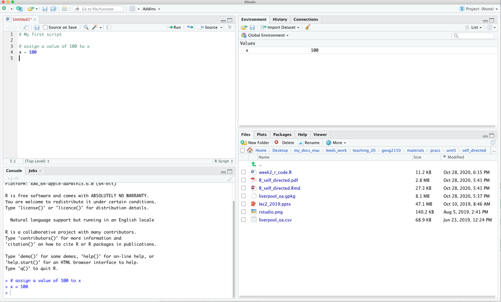

--- 
title: "GEOG3915 GeoComputation and Spatial Analysis practicals"
author: "Lex Comber"
date: "`r Sys.Date()`"
site: bookdown::bookdown_site
documentclass: book
bibliography: [book.bib, packages.bib]
url: https://bookdown.org/lexcomber/geog3915/
cover-image:  images/GIS_in_the_bin.jpg
description: |
  This contains materials to support the University of Leeds GEOG3195 module, delivered by Lex Comber
link-citations: yes

---

```{r eval = T, echo = F}
select <- dplyr::select
summarise <- dplyr::summarise
recode <- dplyr::recode
rename <- dplyr::rename
plot_grid <- cowplot::plot_grid
```

# Getting Started

This is an on-line book written to support the practicals for the GEOG3915 GeoComputation and Spatial Analysis module, delivered by Lex Comber of the School of Geography, from the University of Leeds. It draws from *An Introduction to Spatial Analysis and Mapping* by @brunsdon2018introduction (link  [here](https://us.sagepub.com/en-us/nam/an-introduction-to-r-for-spatial-analysis-and-mapping/book258267)) which provides a foundation for spatial data handling, GIS-related operations and spatial analysis in R. 

Each chapter is self contained and with instructions for loading and data and packages as needed and some have an additional optional exercise that extend the technique being illustrated or describe important related approaches. The sequence of practicals and topics will build as we progress through the module.

**BUT** In some weeks, there may be more text and detailed information in the practical online web page than others. For example, this may include equations (sorry!), discussions about the techniques being explored, links to references of related work, etc. These provide you with the context and wider understanding around the techniques that are being applied in the practical. 

For these reasons it is strongly recommended that you read through the practical **before** attending the practical session. 

This week's practical is intended to refresh your spatial data handling skills in R/RStudio. The firs part is intended as a refresher of how to work in R / RStudio and the second part illustrates how R / RStudio can be used to manipulate spatial data.

## Installing R/RStudio

You have 2 options for accessing Rstudio IDE (integrated development environment - essentially a nicer interface to R than just R!). 

**1. Install it on your own computer** To do this, you download R and Rstudio but you **MUST**  install R **BEFORE** you install RStudio. To get R go to the download pages on the R website – a quick search for ‘download R’ should take you there, but if not you could try:

- http://cran.r-project.org/bin/windows/base/ for Windows
- http://cran.r-project.org/bin/macosx/ for Mac
- http://cran.r-project.org/bin/linux/ for Linux

RStudio can be downloaded from https://posit.co/download/rstudio-desktop/ and the free distribution of RStudio Desktop is more than sufficient for this module (the version of RStudio is less important as this is essentially provides a wrapper for R).

**2. University of Leeds, PC with AppsAnywhere** You will need to do the following in Apps Anywhere:

1. Open R in AppsAnywhere
2. Then open RStudio also in AppsAnywhere


## R / RStudio Refresh

The aim of this preliminary material is to make sure that you are able to access RStudio, have a secure understanding of some core concepts related to data structures and data operations, and are generally ready to go for the rest of the module. The text below introduces the RStudio interface, some ways of working and some strong suggestions about how you should organise your working folder. Finally, if you are unfamiliar with R should download the `week0.R` file, open it in RStudio and work work through the R code. This has a few reminders of syntax - don't spend too long on it - a maximum of 30 mins. 

### The RStudio Interface
It is expected that you will use **the RStudio interface** to R as it provides  RStudio provides an IDE (an integrated development environment)  via the 4 panes: the Console where code is entered (bottom left), a Source pane with R code  (top left), the variables in the working Environment (top right), Files, Plots, Help etc (bottom right) - see the RStudio environment below. Users can set up their personal preferences for how they like their RStudio interface, by playing with the **pane options** at:\

**Tools > Global Options > Pane Layout**


```{r ch1fig1, echo = F, out.width = '100%', fig.cap = "The RStudio interface."}

```

In the figure above of the RStudio interface,  an R file has been opened (but not saved!), and a line of code has been run. The code appears in the **console** pane (bottom left). The command line prompt in the Console window, the `>`, is an invitation to start entering your commands. The object `x` appears in the **environment** pane. The current working folder is shown in the bottom right pane. There is a comment in the the R script and note that anything that follows a `#` is a comment and is ignored by R.

### Ways of working

It is important you develop rigorous **ways of working** within the RStudio environment. 

- R is a learning curve if you have never done anything like this before. It can be scary. It can be intimidating. But once you have a bit of familiarity with how things work, it is incredibly powerful.

- You will be working from practical worksheets which will have all the code you need. Your job is to try to **understand** what the code is doing and **not** to remember the code. Comments in your code really help.

- To help you do this, you should load the R files into your RStudio session, and add your own comments to help you understand what is going on. This will really help when you return to them at a later date. Comments are prefaced by a hash (`#`) that is ignored by R. Then you can save your code (with comments), run it and return to it later and modify at your leisure.  

The module places a strong emphasis placed on learning by doing, which means that you encouraged to unpick the code that you are given, adapt it and play with it. It is not about remembering or being able to recall each function used but about understanding what is being done. If you can remember what you did previously (i.e. the operations you undertook) and understand what you did, you will be able to return to your code the next time you want to do something similar. To help you with this you should: 

1. Always run your code from an R script... **always**! These are provided for each practical;
1. Annotate you scripts with comments. These prefixed by a hash (`#`) in the code;
1. Save your R script to your folder;
1. In your RStudio session, you should set the working directory to the folder location.


### Projects, Files and Folder Management

You should create a separate directory for each week's practical. Then you should copy the R file to that folder, open the RStudio App (**Do not just double click on the `.R` file**), create a new project, navigating to the folder you have just created:\

**File > New Project > Existing Directory**

Projects provide a container for the work you have done. They have a `.Rproj` file extension and keep everything you need for that piece of work is in one place, separate from other projects that you are working on (see https://r4ds.had.co.nz/workflow-projects.html). 

After you have done the practical, ran and created code, put comments in etc, you can save the R file. When you close R Studio it will give you the option to **Save Current Workspace**. If you do this, then the next time you open that project the working environment will have all the data and variables you loaded or created in your session. 

### Practicals 

The code for each practical is contained in an R file. This has code for you to run (this is not a typing class), modify and play around with, as well as comments with explanations of what is being done. You should:  

- Create a folder for this practical. It should be in suitable place, e.g. in your `geog3195` folder) and should have a suitable name (e.g. `week0`). **Note** that generally you should avoid spaces, hyphens and non-text characters in file and folder names. 
- Go to the VLE and download the `weekX.R` file, and move it to your folder.
- Open RStudio and create a new project, navigating to your folder and give the project a sensible name (e.g. `weekX` - the `.Rproj` bit is automatically added).
- Highlight blocks of code in your script that you want to run. This can be done in a number of ways if the code is highlighted or the cursor is on the line of code 
  - click on the Run icon at the top left of the script pane.
  - entering / pressing **Ctrl + Enter** keys on a PC or **Cmd + Enter** on a Mac.
- Generally avoid entering code directly into the console: the point is to create and modify the code in the script and run it from there. 
- Undertake the tasks in the worksheet. 


### Packages

The `base` installation of R includes many functions and commands. However, more often we are interested in using some particular functionality, encoded into **packages** contributed by the R developer community. Installing packages for the first time can be done at the command line in the R console using the `install.packages` command as in the example below to install the `tidyverse` library or via the RStudio menu via  **Tools > Install Packages**. 

When you install these packages it is strongly suggested you also install the *dependencies*. These are other packages that are required by the package that is being installed. This can be done by selecting check the box in the menu or including `dependency = TRUE` in the command line as below (don't run this yet!):

```{r intro1, eval = F, echo=TRUE, message=FALSE}
install.packages("tidyverse", dependency = TRUE)
```
You may have to set a **mirror** site from which the packages will be downloaded to your computer. Generally you should pick one that is nearby to you.

Further descriptions of packages, their installation and their data structures will be given as needed in the practicals. There are literally 1000s of packages that have been contributed to the R project by various researchers and organisations. These can be located by name at http://cran.r-project.org/web/packages/available_packages_by_name.html if you know the package you wish to use. It is also possible to search the CRAN website to find packages to perform particular tasks at http://www.r-project.org/search.html. Additionally many packages include user guides and vignettes as well as a PDF document describing the package and listed at the top of the index page of the help files for the package. 

As well as `tidyverse` you should install `sf` for spatial data. This can be done as below:

```{r eval = F}
install.packages("sf", dep = TRUE)
```
Remember: you will only have to install a package once!! So when the above code has run in your script you should comment it out. For example you might want to include something like the below in your R script.   
```{r}
# packages only need to be loaded once
# install.packages("sf", dep = TRUE)
```
Once the package has been installed on your computer then the package can be called using the `library()` function into each of your  R sessions as below.

```{r eval = F}
library(tidyverse)
library(sf)
```
We will use tools (functions) in these packages next week in the first formal practical to load data, undertake some GIS operations and export graphics.


```{r eval = F, include=FALSE}
# automatically create a bib database for R packages
knitr::write_bib(c(
  .packages(), 'bookdown', 'knitr', 'rmarkdown'
), 'packages.bib')
```


### Further Resources

The aim of this section has been to familiarise you with the R environment, if you have not used R before and to make sure you are up and running. If you have but not for a while them hopefully this has acted as a refresher. If this is new to you then you should consider exploring R in a bit. ore detail before we get going in anger next week. Other good on-line *get started in R* guides include:

- The Owen guide (only up to page 28) : https://cran.r-project.org/doc/contrib/Owen-TheRGuide.pdf
- An Introduction to R - https://cran.r-project.org/doc/contrib/Lam-IntroductionToR_LHL.pdf
- R for beginners https://cran.r-project.org/doc/contrib/Paradis-rdebuts_en.pdf

And of course there are my own offerings, particularly Chapter 1 in @comber2020geographical, and the early chapters of @brunsdon2018introduction.


## Using R as a GIS

This section is intended to refresh your spatial data handling skills in R/RStudio. It uses a series of worked examples to illustrate some fundamental and commonly applied  operations on data and spatial datasets. It is based on Chapter 5 of @brunsdon2018introduction and uses a series of worked examples to illustrate some fundamental and commonly applied  spatial operations on spatial datasets. Many of these form the basis of most GIS software. 

Specifically, in GIS and spatial analysis, we are often interested in finding out how the information contained in one spatial dataset relates to that contained in another. The  datasets may be ones you have read into R from shapefiles or ones that you have created in the course of your analysis. Essentially, the operations illustrate different methods for extracting information from one spatial dataset based on the spatial extent of another. Many of these are what are frequently referred to as *overlay* operations in GIS software such as ArcGIS or QGIS, but here are extended to include a number of other types of data manipulation. The sections below describe how to create a point layer from a data table with location attributes and the following operations:

 + Intersections and clipping one dataset to the extent of another
 + Creating buffers around features
 + Merging the features in a spatial dataset
 + Point-in-Polygon and Area calculations 
 + Creating distance attributes

An R script with all the code for this practical is provided.

### Data 

Make sure the  `sf`, `tidyverse` and `sf` packages are installed as described above: 

```{r eval = T, message=F, warning=F}
# load the packages
library(tidyverse)
library(sf)
```

And load some data using the code below. This downloads data for Chapter 7 of @comber2020geographical from a repository:https://archive.researchdata.leeds.ac.uk/741/1/ch7.Rdata

```{r}
download.file("https://archive.researchdata.leeds.ac.uk/741/1/ch7.Rdata",
              "./wk1.RData", mode = "wb")
```
You should see file called `wk1.RData` appear in your working directory and then you can load the data:
```{r}
load("wk1.RData")
```
:::: {.noticebox}
**Note** that you can check where your working directory is by entering `getwd()` and you can change (reset) it by going to **Session > Set Working Directory...**.
::::

If you check what is is loaded you should see 3 objects have been loaded into the session via the `wk1.RData` file. 
```{r, eval = F}
ls()
```

Three data files are loaded:

1. `oa` a multipolygon `sf` object of Liverpool census Output Areas (OAs) ($n = 1584$) 
1. `lsoa` a multipolygon `sf` object of Liverpool census Lower Super Output Areas (LSOAs) ($n = 298$) 
1. `properties` a point  `sf` object  scraped from Nestoria (https://www.nestoria.co.uk) ($n = 4230$)

You can examine these in the usual way:
```{r eval = F}
# look at the structure
str(oa)
str(lsoa)
# examine the first 6 rows
head(properties)
```

You may get a warning about `old-style crs object detected` and you can run the code below to correct that:
```{r eval = T}
properties <- st_transform(properties, 4326)
```

The census data attributes in `oa` and `lsoa` describe economic well-being (unemployment (the `unmplyd` attribute)), life-stage indicators (percentage of under 16 years (`u16`), 16-24 years (`u25`), 25-44 years (`u45`), 45-64 years (`u65`) and over 65 years (`o65`) and an environmental variable of the percentage of the census area containing greenspaces (`gs_area`). The unemployment and age data were from the 2011 UK population census (https://www.nomisweb.co.uk) and the greenspace proportions were extracted from the Ordnance Survey Open Greenspace layer (https://www.ordnancesurvey.co.uk/opendatadownload/products.html). The spatial frameworks were from the EDINA data library (https://borders.ukdataservice.ac.uk). The layer are projected to the OSGB projection (EPSG 27700) and has a geo-demographic class label (`OAC`) from the OAC (see https://data.cdrc.ac.uk/dataset/output-area-classification-2011).

We will work mainly with the `oa` and `properties` layers in this practical. 

The `properties` data was downloaded on 30th May 2019 using an API (https://www.programmableweb.com/api/nestoria). It contains latitude (`Lat`) and longitude (`Lon`) in decimal degrees,allowing an `sf` point layer to be created from it, price in 1000s of pounds (£), the number of bedrooms and 38 binary variables indicating the presence of different keywords in the property listing such as Conservatory, Garage, Wood Floor etc. 

The code below creates a flat data table in `tibble` format from the `properties` spatial point layer. The aim here is to have a simple data table with location attributes to work with

```{r}
# create a tibble (like a data frame) of property price bedrooms and location
props <- 
  # extract the data frame by dropping geometry
  properties |> st_drop_geometry() |> 
  # select price, bedrooms, type and location
  select(Price, Beds, Lon, Lat) |> 
  # conver to tibble format data table
  tibble()
# check
props
```

```{r eval = F}
# remove the original layer and check
rm(properties)
ls()
```

Examining `props` shows that it has 4,230 observations and 4 fields or attributes. This is as standard flat data table format, with rows representing observations (people, places, dates, or in this cases house sales) and columns represent their attributes. 

:::: {.noticebox}

**Note: Piping**
The syntax above uses  piping syntax (`|>`) to pass the outputs of one function to the input of another. We will cover this syntax in more detail next week. But for now note that the functions `st_drop_geometry()`, `select` and `tibble()` both have a data table of some kind as the first argument.  

::::


### Creating point data 

The properties data `props` has locational attributes, `Lat` and `Lon` that can be used to convert it from a flat data table to point data using the `st_as_sf()` function:
```{r eval = F}
# check the names
names(props)
```

```{r}
# pass them in to the function as the `coords` parameter
properties = st_as_sf(props, coords = c("Lon", "Lat"), crs = 4326)
```

Note the use of `crs = 4326`: this specifies the projection of the coordinates in the `Lat` and `Lon` attributes. Here we know they are WGS84 the global standard for location, in which location is recorded in decimal degrees (see https://en.wikipedia.org/wiki/World_Geodetic_System), and the EPSG code for WGS84 is 4326 (https://epsg.io/4326))

This can be plotted using a standard `ggplot` approach using the code below. This will be covered in detail in next week's practical.
```{r ch1fig2, eval = T, fig.cap = "Proprties for sale in the Liverpool area."}
ggplot(properties) + 
  geom_sf(aes(col = Price)) +
  scale_colour_viridis_c(option = "inferno", direction = -1)
```

:::: {.qbox}
::: {.center}
**Task 1**
:::
Write some code that generates an map of the number of bedrooms for the observations / records in the  `properties` layer. 

**NB** You could attempt the tasks after the timetabled practical session. Worked answers are provided in the last section of the worksheet.

::::


### Spatial Operations

Now, consider the situation where the aim was to analyse the incidence of properties for sale in the Output Areas of Liverpool: we do not want to analyse *all* of the properties data but only those records that describe events in our study area - the area we are interested in.

This can be plotted using the usual commands as in the code below. You can see that the plot extent is defined by the spatial extent of the 2 layers (`oa` and `properties`):
```{r ch1fig3, eval=T, echo=TRUE, message=FALSE, fig.cap = "The OAs in Liverpool and the locations of properties for sale."}
ggplot() + 
  # plot the areas
  geom_sf(data = oa, fill = NA, lwd = 0.1, col = "black") +
  # add the points 
  geom_sf(data = properties, size = 0.4, col = "#FB6A4A") +
  # define some style / plotting options
  theme_linedraw()
```

There are a number of ways of clipping spatial data in R. The simplest of these is to use the spatial extent of one as an index to subset another. 

**BUT** to undertake **any spatial operation** with 2 spatial layers, they must be in the same projection. The `ggplot` operation above was able to handle the different projections of `oa` and `proprties` but spatial operations will fail. Examine the properties layer and note its projection, particularly through the  `Bounding box` and `Geodetic CRS` or `Projected CRS` metadata at the top of the print out and the `geometry` attributes:
```{r eval = F}
oa
properties
```

Now change the projection of `properties` to the Ordnance Survey OSGB projection (EPSG 27700 - see https://epsg.io/27700) and re-examine:

```{r eval = F}
properties = st_transform(properties, 27700)
properties
```

```{r echo = F}
properties = st_transform(properties, 27700)
```

The spatial extent of the `oa` layer can now be used to clip out the intersecting observations form the `proprties` layer: 
```{r}
prop_clip = properties[oa,]
```

This simply *clips out* the data from `properties` that is within the spatial extent of `oa`. You can check this:
```{r eval = F}
ggplot() +
  geom_sf(data = oa) +
  geom_sf(data = prop_clip)
```

However, such clip (or crop) operations simply subset data based on their spatial extents. There may be occasions when you wish to combine the *attributes* of difference datasets based on the *spatial intersection*. The `st_intersection` in `sf` allows us to do this as shown in the code below. 
```{r echo = T, cache = F}
prop_int <- st_intersection(oa, properties)
```

The `st_intersection` operation and the clip operation are based on spatial extents, do the same thing and the outputs are the same dimension but with subtle differences:
```{r eval = F}
prop_clip
prop_int
```
If you examine the data created by the intersection, you will notice that each of the intersecting points has the full attribution from both input datasets (you may have to scroll up in your console to see this!):
```{r eval = F}
head(data.frame(prop_clip))
head(data.frame(prop_int))
```


:::: {.qbox}
::: {.center}
**Task 2**
:::
Write some code that selects the polygon in `oa` with the OA code E00033902 (in the `code` attribute in `oa`) and then clips out the properties in that polygon. How many properties are there in E00033902?

::::


### Merging spatial features and Buffers

In many situations, we are interested in events or features that occur near to our area of interest as well as those within it. Environmental events such as tornadoes, for example, do not stop at state lines or other administrative boundaries. Similarly, if we were studying crimes locations or spatial access to facilities such as shops or health services, we would want to know about locations near to the study area border. Buffer operations provide a convenient way of doing this and buffers can be created in R using the `st_buffer` function in `sf`.

Continuing with the example above, we might be interested in extracting the properties within a certain distance of the Liverpool area, say 2km. Thus the objective is to create a 2km buffer around Liverpool and to use that to select from the properties dataset. The buffer function allow us to do that, and requires a distance for the buffer to be specified in terms of the units used in the projection.

The code below create a buffer, but does it for each OA - this is not we need in this case!

```{r eval=FALSE, echo=TRUE, message=FALSE}
# apply a buffer to each object
buf_liv <- st_buffer(x = oa, dist = 2000)
# map
ggplot() + 
  geom_sf(data = buf_liv)
```
The code below uses `st_union` to merge all the OAs in `oa` to a single polygon and then uses that as the object to be buffered: 

```{r ch1fig4, eval = T, fig.cap = "The outline of the Liverpool area (in grey) and a 2km buffer."}
# union the oa layer to a single polygon
liv_merge <- st_sf(st_union(oa))
# buffer this
buf_liv <- st_buffer(liv_merge, 2000)
# and map
ggplot() + 
  geom_sf(data = liv_merge) +
  geom_sf(data = buf_liv, fill = NA) +
  theme_linedraw()
```


### Point-in-polygon and Area calculations

**Point-in-polygon**

It is often useful to count the number of points falling within different zones in a polygon data set. This can be done using the  the `st_contains` function in `sf`.

The code below returns a list of counts of the number properties that occur inside each OA to the variable `prop.count` and prints the first six of these to the console using the `head` function: 

```{r eval=T, echo=TRUE, message=FALSE}
tmp = st_contains(oa, properties, sparse = F)
prop.count = rowSums(tmp)
head(prop.count)
length(prop.count)
```
Each of the observations in `prop.count` corresponds in order to the OAs in `oa` and could be attached to the data in the following way: 
```{R eval = T}
oa$prop.count = prop.count
```

This could be mapped using the code below, using best practice for counts (choropleths should only be used for rates!):

```{r ch1fig5, eval = T, fig.cap = "The the counts of properties for sale in the OAs in Liverpool."}
ggplot() + 
  geom_sf(data = oa) +
  geom_sf(data = st_centroid(oa), aes(size = prop.count, col = prop.count), alpha = 0.5) +
  scale_colour_distiller(palette = "RdPu", name = "Property\nCount") +
  theme_linedraw()
```

**Area calculations**
Another useful operation is to be able calculate polygon areas. The `st_area` function in and `sf` does this. To check the projection, and therefore the map units, of an `sf` objects use the `st_crs` function:
```{r eval=FALSE, echo=TRUE, message=FALSE}
st_crs(oa)
```
This declares the projection to be in metres. To see the areas in square metres enter: 

```{r Op20, eval=FALSE, echo=TRUE, message=FALSE}
head(st_area(oa))
```
The `Units` are indicated. As these are not particularly useful and more realistic measures are to report areas in hectares or square kilometres. This requires the `units` package:
```{r Op21, eval=FALSE, echo=TRUE, message=FALSE}
library(units)
# hectares
st_area(oa) |> set_units("ha") |> head()
# square kilometres
st_area(oa) |> set_units("km^2") |> head()
```


:::: {.qbox}
::: {.center}
**Task 3**
:::
Your task is to create the code to produce maps of the densities of properties in each LSOA in Liverpool in *properties per square kilometre*. For the analysis you will need to use the `properties` point data and the `lsoa` dataset and undertake a point in polygon operation, apply an area function and undertake a conversion to square kilometres. The maps should be produced using the `ggplot` and `geom_sf` functions in the `ggplot2` package (Hint: use the `scale_fill_distiller` function to change the default palette. The help for this function has the names of other Sequential palettes. 

::::


### Creating distance attributes

Distance is fundamental to spatial analysis. For example, we may wish to analyse the number of locations (e.g. health facilities, schools, etc) within a certain distance of the features we are considering. In the exercise below distance measures are used to evaluate differences in accessibility for different social groups, as recorded in census areas. Such approaches form the basis of supply and demand modelling and provide inputs into location-allocation models. 

Distance could be approximated using a series of buffers created at specific distance intervals around our features (whether point or polygons). These could be used to determine the number of features or locations that are within different distance ranges, as specified by the buffers using the `poly.counts` function above. However distances can be measured directly and there a number of functions available in R to do this. 

First, the most commonly used is the `dist` function. This calculates the Euclidean distance between points in $n-$dimensional feature space. The example below developed from the help for `dist` shows how it is used to calculate the distances between 5 records (rows) in a feature space of 20 hypothetical variables:

```{r eval = F}
# create some random data
set.seed(123) # for reproducibility
x <- matrix(rnorm(100), nrow = 5)
colnames(x) <- paste0("Var", 1:20)
dist(x)
as.matrix(dist(x))
```
If your data is projected (i.e. in metres, feet etc) then `dist` can also be used to calculate the Euclidean distance between pairs of coordinates (i.e. 2 variables not 20!):
```{r eval = F}
coords = st_coordinates(st_centroid(oa)) 
dmat = as.matrix(dist(coords, diag = F))
dim(dmat)
dmat[1:6, 1:6]
```

The distance functions return a to-from matrix of the distances between each pair of locations. These could describe distances between *any* objects and such approaches underpin supply and demand modelling and accessibility analyses. 
When determining geographic distances, it is important that you consider the projection properties of your data: if the data are projected using degrees (i.e. in latitude and longitude) then this needs to be considered in any calculation of distance. The `st_distance` function in `sf` calculates the Cartesian minimum distance (straight line) distance between two spatial datasets of class `sf` projected in planar coordinates. 

The code below calculates the distance between 2 features:
```{r}
st_distance(oa[100,], properties[2,])
```

And this can be extended to calculates multiple distances using a form of apply function. The code below uses `st_distance` to determine the distance from the 100^th observation in `oa` to each of the properties for sale:
```{r eval = T}
g1 = st_geometry(oa[100,])
g2 = st_geometry(properties) 
dlist = mapply(st_distance, g1, g2)
length(dlist)
head(dlist)
```

You could check this by mapping the properties data, shaded by their distance to this location:
```{r ch1fig6, fig.cap = "A map of the proprties for sale inthe Liverpool area shaded by their distance to the 100th observation."}
ggplot() +
  geom_sf(data = cbind(properties, dlist), aes(col = dlist)) +
  scale_colour_viridis_c(name = "Distance (m)") +
  geom_sf(data = oa[100,], col = "red", lwd = 4) +
  theme_linedraw()
```


### Reading and writing data in and out of R/RStudio

There are 2 basic approaches:

1. read and write data in and out of R/Rstudio in propriety formats such as shapefiles, CSV files etc.
2. read and write data using `.Rdata` files in R's binary format and the load and save functions.

The code below provides does these as a reference for you:

**Tabular data (CSV format)**
```{r eval = F}
write.csv(props, file = "props.csv", row.names = FALSE)
p2 = read.csv("props.csv", header=TRUE)
```

**Tabular data (.RData format)**
```{r eval = F}
save(props, file = "props.RData")
load("props.RData") # notice that this needs no assignation e.g. to p2 or props
```

**Spatial data (Proprietary format)**
```{r eval = F}
# as shapefile
st_write(properties, "point.shp", delete_layer = T)
p2 = st_read("point.shp")
# as GeoPackage
st_write(oa, "area.gpkg", delete_layer = T)
a2 = st_read("area.gpkg")
```

**Spatial data (R format)**
```{r eval = F}
save(oa, file = "areas.RData")
load("areas.RData") # notice that this needs no assignation e.g. to p2 or props
```


### Answers to Tasks

**Task 1** Write some code that generates an map of the number of bedrooms for the observations / records in the  `properties` layer. 
```{r eval = F}
# if you look at the Beds attributes 
# you will see it is an ordinal value (ie an ordered category)
properties
# so each vale is automatically assigned a group 
ggplot(properties) + 
  geom_sf(aes(col = Beds)) +
  scale_colour_viridis_d(option = "inferno", direction = -1)
```

**Task 2** Write some code that selects the polygon in `oa` with the OA code E00033902 (in the `code` attribute in `oa`) and then clips out the properties in that polygon. How many properties are there in E00033902?

```{r eval = F}
# Task 2
## There are lots of ways of doing this but each of them uses a logical statement

# 1. using an index to create a subset and then clip
index = oa$code == "E00033902"
oa_select = oa[index,]
properties[oa_select,]

# 2. using the layer you have created already 
sum(prop_int$code == "E00033902")
```


**Task 3** Produce a map of the densities of properties for sale in each LSOA block in Liverpool in *properties per square kilometre*. 


```{r eval = F}
# Task 3
# point in polygon
p.count <-  rowSums(st_contains(lsoa,properties,sparse = F))
# area calculation
lsoa.area <- st_area(lsoa) |> set_units("km^2")
# combine and assign to the oa data
lsoa$p.p.sqkm <- as.vector(p.count/lsoa.area)
# map
ggplot(data = lsoa) +
  geom_sf(aes(fill = p.p.sqkm)) +
  scale_fill_distiller(palette = "RdPu", name = "Property\nCount") 
```


### Useful Resources

There are few links in the list below that you may find useful:

- Piping syntax (I love this guy!) https://www.youtube.com/watch?v=0_lSx0CJiSc
- Spatial operations, Chapter 4 in https://geocompr.robinlovelace.net/spatial-operations.html
- An Intro to Spatial Data Analysis https://www.spatialanalysisonline.com/An%20Introduction%20to%20Spatial%20Data%20Analysis%20in%20R.pdf
- Making Maps with R https://bookdown.org/nicohahn/making_maps_with_r5/docs/introduction.html
- Chapter 5 in  https://geocompr.robinlovelace.net/adv-map.html
- An Introduction to Spatial Data Analysis and Visualisation in R https://data.cdrc.ac.uk/dataset/introduction-spatial-data-analysis-and-visualisation-r


```{r echo = F, eval = F}
knitr::purl("index.Rmd", output = "week1.R", documentation = 0)
bookdown::publish_book(name = "GEOG3195", account = "lexcomber")
```


